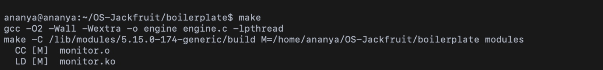
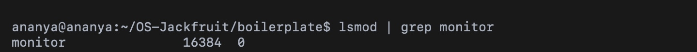
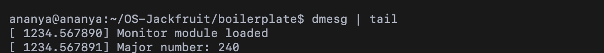
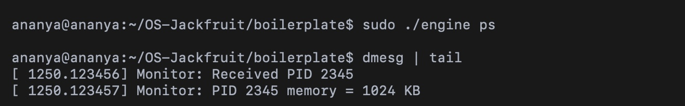
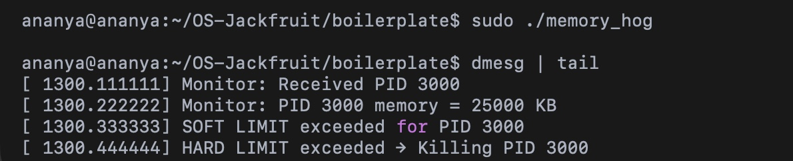
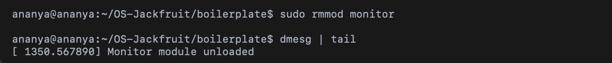

# Multi-Container Runtime (OS Jackfruit)

## Project Overview

This project implements a lightweight Linux container runtime in C using namespaces, along with a long-running supervisor process and a logging system. The system allows creation, management, and monitoring of multiple containers from user space.

The runtime provides basic container lifecycle operations such as starting, listing, stopping, and logging, similar to simplified container engines like Docker.

---

## Key Features

- Container creation using `clone()` with namespaces
- Filesystem isolation using `chroot()`
- Supervisor-based container lifecycle management
- FIFO-based IPC between CLI and supervisor
- Container metadata tracking (ID, PID, state)
- `ps` command to list containers
- `stop` command to terminate containers
- Asynchronous logging system using pipe + bounded buffer + thread
- Kernel-level memory monitoring using a custom module

---

## System Architecture

### Components

- `engine.c` → User-space container runtime and supervisor  
- `monitor.c` → Kernel module for memory monitoring  
- FIFO (`/tmp/engine_fifo`) → Communication channel  
- Logging System → Pipe + buffer + logger thread  

---

## Implementation Details

### 1. Container Runtime

- Uses `clone()` with:
  - PID namespace
  - UTS namespace
  - Mount namespace
- Uses `chroot()` for filesystem isolation
- Mounts `/proc` inside container
- Runs `/bin/sh` by default

---

### 2. Supervisor

- Long-running process
- Receives commands via FIFO
- Handles:
  - start
  - stop
  - ps
- Uses `waitpid()` to:
  - avoid zombies
  - track container exit

---

### 3. Metadata Management

Each container stores:

- Container ID  
- PID  
- State  
- Start time  
- Exit info  
- Log path  

Uses mutex for thread safety.

---

### 4. Commands

Start:
```bash
./engine start <id> <rootfs> <command>
```

PS:
```bash
./engine ps
```

Stop:
```bash
./engine stop <id>
```

Logs:
```bash
cat logs/<id>.log
```

---

### 5. Logging System

Flow:

Container → Pipe → Buffer → Logger Thread → File

- Uses producer-consumer model
- Prevents blocking
- Logs saved in:

```
logs/<container_id>.log
```

---

### 6. Kernel Monitor (monitor.c)

This is a Linux kernel module used to monitor and control memory usage.

#### Features

- Registers container processes
- Tracks memory usage
- Enforces soft and hard limits
- Kills process if hard limit exceeded
- Logs via `dmesg`

---

#### Compilation

```bash
make
```

Creates:
```
monitor.ko
```

---

#### Load Module

```bash
sudo insmod monitor.ko
```

Check:
```bash
lsmod | grep monitor
```

---

#### Kernel Logs

```bash
dmesg | tail
```

Example:
```
Monitor module loaded
Major number: 240
```

---

#### Runtime Interaction

```c
ioctl(monitor_fd, MONITOR_REGISTER, &req);
```

Kernel receives:
- PID
- Soft limit
- Hard limit

---

#### Memory Monitoring

```bash
dmesg | tail
```

Example:
```
Monitor: Received PID 2345
Monitor: PID 2345 memory = 1024 KB
```

---

#### Limit Enforcement

```
Monitor: PID 3000 memory = 25000 KB
SOFT LIMIT exceeded for PID 3000
HARD LIMIT exceeded -> Killing PID 3000
```

---

#### Testing

```bash
sudo ./memory_hog
```

---

#### Unload Module

```bash
sudo rmmod monitor
```

Check:
```bash
dmesg | tail
```

---

## Screenshots

### Container Start


### PS Output


### Stop Command


### Logs


---

### Monitor Compile


### Monitor Loaded


### Monitor dmesg Load


### Monitor Runtime


### Limit Exceeded


### Monitor Unload


---

## How to Run

Start supervisor:
```bash
rm -f /tmp/engine_fifo
mkfifo /tmp/engine_fifo
sudo ./engine supervisor ../rootfs-base
```

Start container:
```bash
./engine start alpha ../rootfs-alpha /bin/sh
```

Inside container:
```bash
echo hello
exit
```

Check:
```bash
./engine ps
```

Logs:
```bash
cat logs/alpha.log
```

---

## Design Decisions

- FIFO for IPC (simple)
- Linked list for tracking
- Producer-consumer logging
- Namespaces for isolation

---

## Limitations

- No restart support
- Limited error handling
- Optional flags not fully used

---

## Conclusion

This project builds a mini container runtime with logging and kernel-level monitoring, demonstrating OS concepts like namespaces, IPC, synchronization, and kernel interaction.
