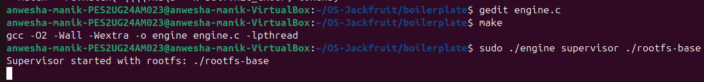
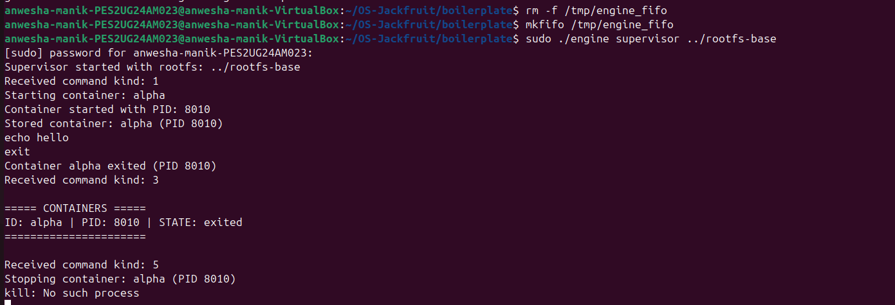
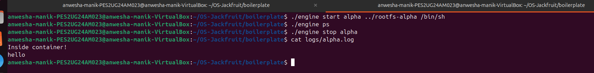

# Multi-Container Runtime (OS Jackfruit)

## Project Overview

This project implements a lightweight Linux container runtime in C using namespaces, along with a long-running supervisor process and a logging system. The system allows creation, management, and monitoring of multiple containers from user space.

The runtime provides basic container lifecycle operations such as starting, listing, stopping, and logging, similar to simplified container engines like Docker.

---

## Key Features

* Container creation using `clone()` with namespaces
* Filesystem isolation using `chroot()`
* Supervisor-based container lifecycle management
* FIFO-based IPC between CLI and supervisor
* Container metadata tracking (ID, PID, state)
* `ps` command to list containers
* `stop` command to terminate containers
* Asynchronous logging system using pipe + bounded buffer + thread

---

## System Architecture

### Components

* **engine.c** → User-space container runtime and supervisor
* **monitor.c** → Kernel module for resource monitoring (handled separately)
* **FIFO (/tmp/engine_fifo)** → Communication channel between CLI and supervisor
* **Logging System** → Pipe + bounded buffer + logger thread

---

## Implementation Details

### 1. Container Runtime

* Containers are created using `clone()` with:

  * PID namespace
  * UTS namespace
  * Mount namespace
* `chroot()` is used for filesystem isolation
* `/proc` is mounted inside each container
* Default execution uses `/bin/sh`

---

### 2. Supervisor

* A long-running process that manages all containers
* Receives commands via FIFO (`/tmp/engine_fifo`)
* Handles:

  * Container creation (`start`)
  * Container termination (`stop`)
  * Container listing (`ps`)
* Uses `waitpid()` to:

  * Detect container exit
  * Prevent zombie processes
  * Update container state

---

### 3. Metadata Management

Each container is tracked using a linked list structure containing:

* Container ID
* Host PID
* State (running, stopped, exited, killed)
* Start time
* Exit code / signal
* Log file path

Thread-safe access is ensured using a mutex.

---

### 4. Commands

#### Start Container

```bash
./engine start <id> <rootfs> <command>
```

#### List Containers

```bash
./engine ps
```

#### Stop Container

```bash
./engine stop <id>
```

#### View Logs

```bash
cat logs/<id>.log
```

---

### 5. Logging System

* Each container’s stdout/stderr is redirected using a pipe
* Supervisor reads from the pipe
* Logs are pushed into a bounded buffer (producer-consumer model)
* A dedicated logging thread writes logs to:

```
logs/<container_id>.log
```

This ensures:

* Non-blocking logging
* Thread-safe data handling
* Separation of execution and logging

---

## Screenshots

### 1. Container Start and Execution



This screenshot shows the supervisor starting a container using the `start` command. The container is created using namespaces and a shell is launched inside it.

---

### 2. Container Listing (ps Command)


This screenshot shows the output of the `ps` command, which lists all containers along with their container ID, host PID, and current state.

---

### 3. Stop Command and Lifecycle Handling



This screenshot demonstrates stopping a container using the `stop` command. The supervisor correctly handles termination and updates the container state.

---

### 4. Logging System Output



This screenshot shows the logging system capturing container output. The container’s stdout is redirected and stored in a log file (`logs/alpha.log`).

---

## How to Run

### 1. Start Supervisor

```bash
cd boilerplate
rm -f /tmp/engine_fifo
mkfifo /tmp/engine_fifo
sudo ./engine supervisor ../rootfs-base
```

### 2. Start Container

```bash
./engine start alpha ../rootfs-alpha /bin/sh
```

### 3. Inside Container

```bash
echo hello
exit
```

### 4. View Containers

```bash
./engine ps
```

### 5. View Logs

```bash
cat logs/alpha.log
```

---

## Design Decisions

* **FIFO IPC** chosen for simplicity and reliability
* **Linked list metadata** for dynamic container tracking
* **Producer-consumer logging** for efficient asynchronous logging
* **Namespaces + chroot** for lightweight container isolation

---

## Limitations

* Optional flags (`--soft-mib`, `--hard-mib`, `--nice`) not implemented
* No container restart functionality
* Kernel monitor integration handled separately

---

## Conclusion

This project successfully implements a minimal container runtime with process isolation, lifecycle management, and asynchronous logging. It demonstrates key operating system concepts such as process control, inter-process communication, synchronization, and namespace-based isolation.

---
